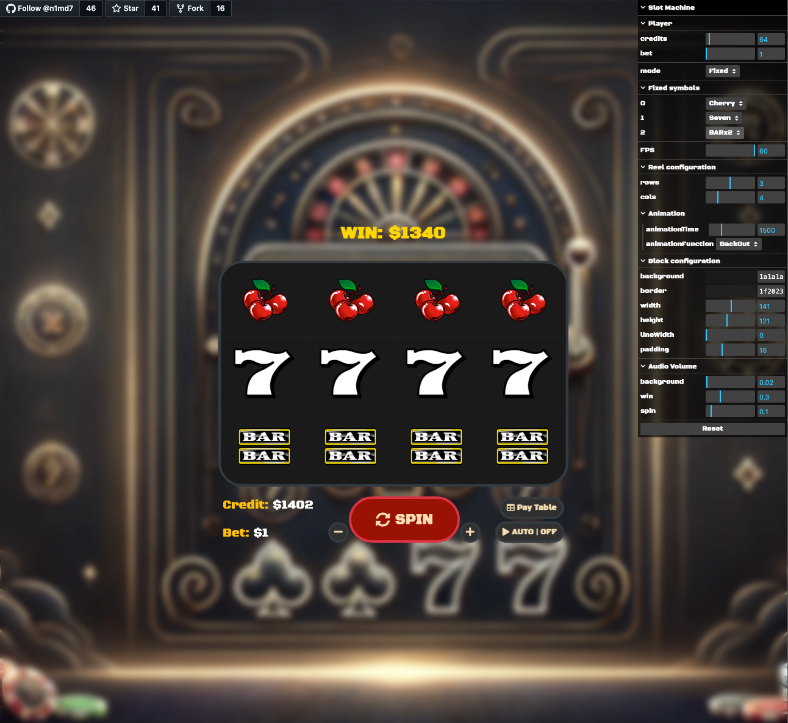

Check out a new version written in PixiJS (https://github.com/n1md7/mini-slot)

## Slot Game with Configurable GUI

This vanilla JavaScript slot game features a dynamic and customizable user interface using a tweak panel, allowing
players to adjust various game settings without the need for external builders or frameworks. The game supports bets up
to $15, configurable reel and column layouts, custom colors, and auto-spin functionality.

### Key Features:

- **Betting System**: Players can place bets from $1 up to $15, adjusting their bet size dynamically via the GUI.
- **Configurable Reels & Columns**: The number of rows and columns for the slot reels can be customized, with reels
  supporting between 1 and 5 rows, and columns adjustable from 3 to 7.
- **Symbol Selection**: Supports both random and fixed symbol modes. In fixed mode, players can manually assign symbols
  to reels.
- **Animations**: Includes adjustable animation speed and easing functions (linear, bounce, elastic, etc.) for a smooth
  reel spin experience.
- **UI Customization**: Players can tweak block dimensions, padding, line widths, and background/border colors.
- **Auto-spin Support**: The game offers an auto-spin feature for continuous gameplay.
- **Audio Control**: Volume controls for background music, win sounds, and spin effects can be adjusted through the
  tweak panel.
- **Responsive Reset Function**: Players can reset all configurations back to default settings with a single click.

The tweak panel offers fine-grained control over the game's aesthetics and mechanics, making it highly customizable and
player-friendly.

---

It has static files (Vanilla Javascript). No builders are required.

However, can be served over `http-server` by running

```bash
npm run serve
# Or
bun run serve


# Make sure you install dependencies first
npm install
# Or
bun install
```


